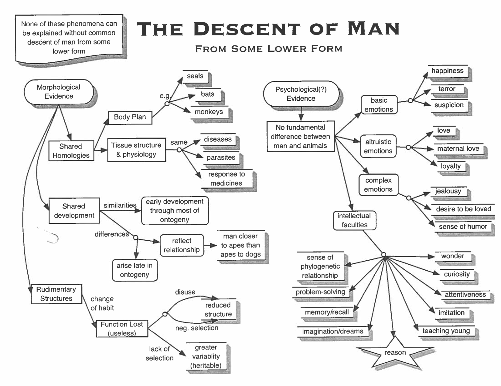
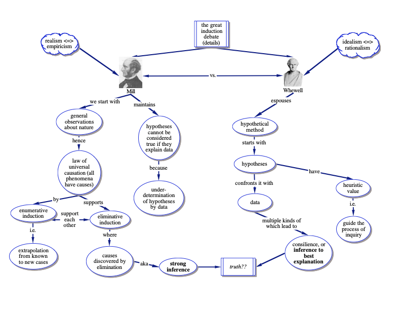

# Concept Maps

Concept maps are visual representations of an argument or hypothesis.  It is a diagram that represents the *relationships* between *ideas*.  They can be helpful for attaining a deeper understanding of scientific papers, which are typically complex and multi-layered. They help to focus on the main concepts or ideas, and force us to link the connecting ideas and how they are related, building up the logical structure of the argument in a heirarchical manner. 

## Mechanics

### The basic units of the concept map are the concepts and their relationships:

- **Ideas** or **concepts** are drawn as *circles or boxes* (called nodes). 
- **Relationships between ideas** are indicated on *lines* or *arrows* with *linking words*. 

### Deeper meaning can be represented with:

- **Propositions** are statements made up of *two or more concepts connected with linking words*. Developing propositions are the building blocks for creating new knowledge. 
- **Heirarchical arrangement** from the most general and inclusive concepts at the top, and linking refinements or subsidary ideas heirarchichally. 
- **Cross-links** connect relationships between different domains of the concept map, to show relationships across domains (at a broader scale).

### Developing good concept maps usually require some revision

- Begin a draft with a **Focus Question** which defines the question or problem that the concept map is designed to answer.
- Put up a **Parking Lot** or a list of key ideas or concepts that you want to include in the concept map. Writing this list is a good brainstorming practice. Perhaps order the ideas heirarchically. Move the ideas from the parking lot to the concept map as you build it. 

## How to create a concept map 

It is helpful to do this with pencil and paper. Your concept map should fit on a single 8.5x11 piece of paper. 

1. **Identify the focus question.** What is the main topic?
2. **Brainstorm the parking lot.** List all of the words, facts, key ideas, themes, and concepts associated with the main topic. Refine - are they duplicates or not? Think about their place in the heirarchy.
3. **Connect the concepts** with linking phrases that connect the ideas. Be as concise as possible and use verbs (e.g., "causes", "includes", "requires", etc.) 
4. **Sketch it out.** Figure out the central idea, related topics, and more specific ideas. 
5. **Review the map.** Does the main idea pop? Are the linking phrases strong? Is the order and relationship of the ideas clear? Does it help us with critical thinking and attaining a deeper understanding of this intellectual contribution?

A concept map about concept maps (from Wikimedia):

