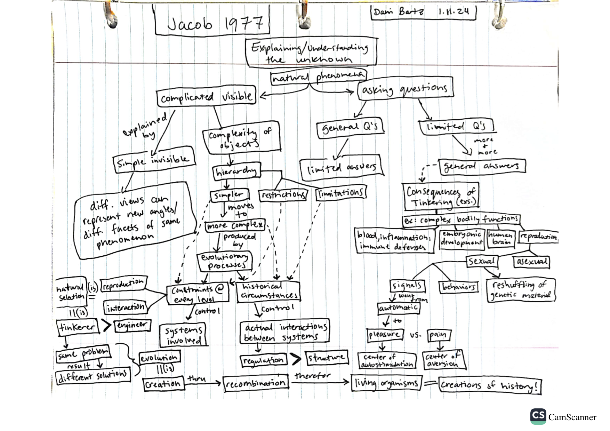

# Jan 11

## Evolution and Tinkering

1. [Jacob, F. 1977](http://web.mit.edu/~tkonkle/www/BrainEvolution/Meeting9/Jacob%201977%20Science.pdf). Evolution and Tinkering. *Science*. 196(4295):1161-1166.  

### Francois Jacob

* Molecular Biologist, Institut Pasteur, 1920 - 2013  
* Won the [Nobel Prize in Physiology or Medicine in 1965](https://www.nobelprize.org/prizes/medicine/1965/summary/) together with Jacques Monod and Andre Lwoff "for their discoveries concerning genetic control of enzyme and virus synthesis". They had originated the idea that control of enzyme levels in all cells occurs through the regulation of transcription. 
* As a youth, Jacob was talented in physics and mathematics, but did not enjoy the rigors of the disciplines, and instead entered medical school to study surgery. 
* Jacob was born into a seccular Jewish family and in his second year of medical school, when Germany occupied France, he went to Great Britain to join the war effort [[biography](https://www.nobelprize.org/prizes/medicine/1965/jacob/biographical/)]. He was severely wounded in 1944 in Normandy and recovered for 7 months in hospital. Post-war, he completed medical school in 1947 but was unable to perform surgery and obtained a doctorate in science in 1954 at the Sorbonne with his thesis "Lysogenic bacteria and the provirus concept". 
* Scientific contributions - 
  * Worked mainly with genetic mechanisms in bacteria and bacteriophages, bacterial immunity, bacterial conjugation. Many new concepts including male to female genetic transfer between bacteria, circularity of the bacterial chromosome.
  * Book: "Sexuality and the Genetics of Bacteria"
  * Another branch of work focused on regulatory pathways in bacteria that adjust the activity and synthesis of macromolecules, which led to the ideas of mRNA, reglulator genes, operons, and allosteric proteins.
  * Demonstrated that cellular biochemical processes are ultimately controlled by genes encoded by DNA. 
  * The concept of messenger RNA - genetic information is converted to proteins by means of a messenger, which turned out to be RNA. 
  * Timing of cellular activity is also regulated by genes.
  * Mapped gene expression as a self-regulating process.
  * The uniquity of molecular regulatory processes let Jacob to think of implications for evolutionary biology. [Racine (2014)](https://embryo.asu.edu/items/172791) notes that Jacob was influenced by the work of Claude Levi-Strauss, a linguist and anthropologist, who argued for a deeper understanding of human communicaiton by recognizing the units of the signifier and the signified, and their relationships. 
* The 1977 address "Evolution and Tinkering" synthesizes his ideas on moleculary biology and his philosophy of science and the scientific method. 
 
  
Very optional commentary (read after you do your concept map):
[Racine, Valerie 2014](https://embryo.asu.edu/items/172791) "Evolution and Tinkering" (1977), by Francois Jacob". Embryo Project Encyclopedia ( 2014-10-24 ). ISSN: 1940-5030 https://hdl.handle.net/10776/8227

## Dani

