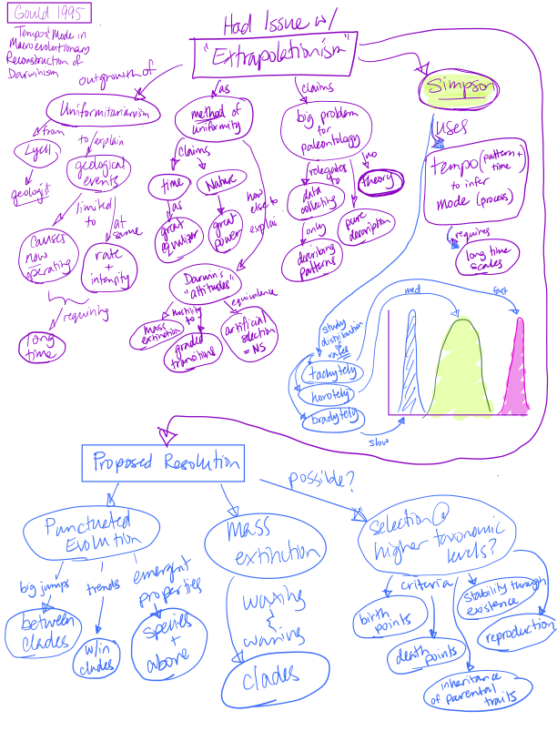
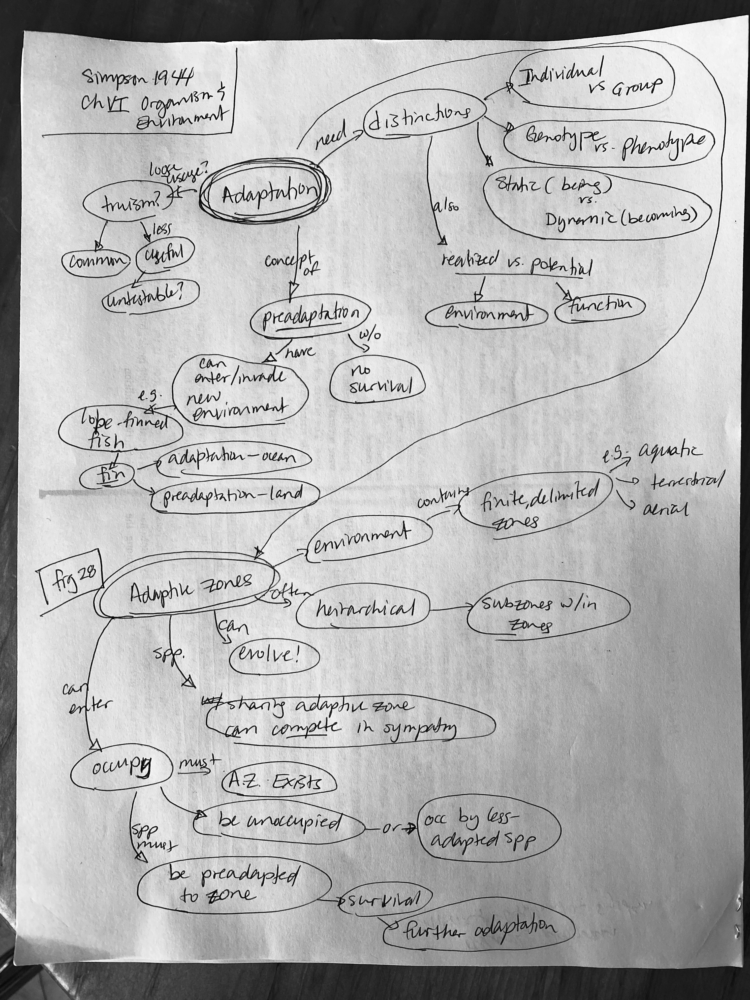

# Jan 25

Belated Notes: On Mayr 1985 [linked here](../2024-01-17-darwinism/Mayr1985_notes.jpg).  
Acknowledgement: Thanks to Dr. Alan Larson for the wonderful annotations.   

## III. Tempo and Mode in Evolution

7. [Gould, S. J. 1995](https://drive.google.com/drive/u/0/folders/1ocqMPD5gX9xi4VQy_5OtU5wSyg-X8ftM). Tempo and mode in the macroevolutionary reconstruction of Darwinism. Pp. 125-144 in W. M. Fitch and F. J. Ayala (eds.) Tempo and Mode in Evolution: Genetics and Paleontology 50 Years after Simpson. National Academy Press, Washington.  **map:Marguerite**

Annotation: Gould, S. J. (1995) - argues that a hierarchically expanded evolutionary theory is needed to accommodate the study of macroevolutionary phenomena. This theory is a direct challenge to the utility of gradualism and natural selection as presented in the Origin and Mayr 1985, although it accepts the other major components of Darwinism. A major focus of this class is to ask whether traditional Darwinism or a hierarchically expanded theory as advocated here should guide macroevolutionary study.

8. [Simpson, G. G. 1944](https://drive.google.com/drive/u/0/folders/1ocqMPD5gX9xi4VQy_5OtU5wSyg-X8ftM). Tempo and Mode in Evolution. Columbia Univ. Press, New York. (Pp. 197-217)  **map:Marguerite**

Annotation: Simpson, G. G. (1944) - excerpts from a classic work by the paleontologist credited with bringing paleontology and systematics into the Darwinian evolutionary synthesis and discrediting formerly popular theories of orthogenesis and neo-Lamarckism. Stephen Jay Gould adopts Simpson's conceptual framework for the role of paleontology in evolutionary studies, but he challenges Simpson's substantive conclusions. Note especially Simpson's categorization of evolutionary modes and tempos, and how studies of fossils are intended to use measurements of tempo to infer mode.

### Stephen Jay Gould

* Paleontolgist, Harvard/NYU, 1941 - 2002  
* Prolific writer, many popular writings that popularized evolutionary biology  
  * Scientific contributions - most important "Punctuated Equilibrium" with Niles Eldridge  
  * Book: Ontogeny and Phylogeny 1977 idea: Ernst Haekelʻs "Ontogeny recapitulates phylogeny"   
  * Popular books: "The Pandaʻs Thumb", "Henʻs Teeth and Horseʻs Toes", "Wonderful Life: the Burgess shale and the nature of history"  
  * Final masterpiece: "The Structure of Evolutionary Theory" 2002  

### George Gaylord Simpson

* Paleontologist, 1902 - 1984
* *Tempo and Mode in Evolution* was one of the major contributions to the Modern Synthesis

The "Modern Synthesis" or the birth of Neo-Darwinism was the reinterpretation of Darwinʻs theories in the light of geentics.  
Two stages of development:
1) Population Genetic Core in 1920ʻs-30ʻs by RA Fisher, Sewell Wright, and JBS Haldane
  * very mathematical
2) Alignment with more traditional disciplines including Natural History: Dobzhansky (genetics) 1937, Mayr (systematics) 1942, Simpson (paleontology) 1944, Stebbins (botany) 1950
  * **only Simpson had mathematical background to understand Pop Gen core**

### Concept Maps

## Gould 1995 Tempo and Mode in the Macroevolutionary Reconstruction of Darwinism

Questions:

1. What are the inherent difficulties in defining selection at levels higher than the organism? Are these serious or fatal?

2.  Is Gould’s argument merely ego? Or is there a substantive intellectual component when extrapolating all of macro evolution from micro evolutionary mechanisms? 

## Simpson 1944 Chapter VI - Organism and Environment

## Simpson 1944 Chapter VII - Modes of Evolution

1.  What does Simpson clarify between the organism and the environment in the context of adaptation? What is accomplished? What is the underlying question Simpson is struggling with? Why is it important?

2.  Simpson claims that quantum evolution is most important. Do you agree? Is this just semantics are is there a real mechanistic or process based difference? What is lost without these distictions?
