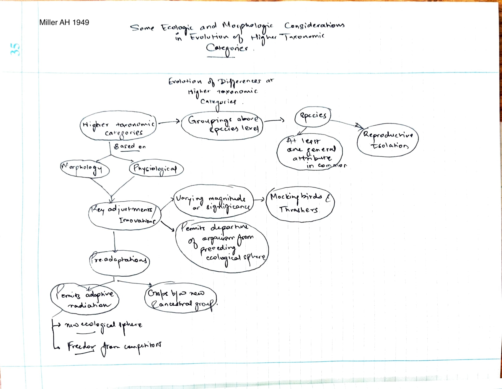
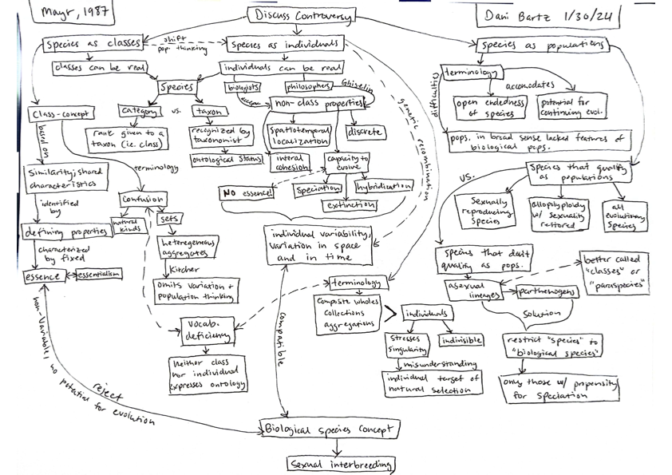

# Jan 30

### A. Evolutionary Taxonomy

Annotations by [Allan Larson](https://biology.wustl.edu/people/allan-larson)  

9. Simpson, G. G. (1953) Ch 11 - excerpts from an updated, expanded and retitled version of the book from Simpson (1944). The strong presence of adaptationist principles in constructing higher taxonomic categories and evaluating their evolutionary origins should be noted, especially the concept of adaptive zone. This adaptationist focus has been criticized by some evolutionists, causing them to prefer the earlier book, which is considered more pluralistic. Simpson's "evolutionary taxonomy" as presented here guided most macroevolutionary study in the latter twentieth century and continues to do so in evolutionary paleontology. Cladistic criticism of it is severe, as subsequent readings show.  

10. [Mayr, E. 1987](https://drive.google.com/drive/u/0/folders/1ocqMPD5gX9xi4VQy_5OtU5wSyg-X8ftM). The Ontological Status of Species: Scientific Progress and Philosophical Terminology. Biology and Philosophy 2(1987)145--166.  **map:Dani**  

(10). [Mayr, E. (1982)](https://drive.google.com/drive/u/0/folders/1ocqMPD5gX9xi4VQy_5OtU5wSyg-X8ftM) - a concise summary and defense of evolutionary taxonomy following challenges by pheneticists and cladists. Note Mayr's defense of the important concept of "grade."   

11. [Miller, A. H. (1949)](https://drive.google.com/drive/u/0/folders/1ocqMPD5gX9xi4VQy_5OtU5wSyg-X8ftM) - an excellent example of evolutionary analysis of the origin of a higher taxonomic category (genus) following Simpsonian principles. This is perhaps the first use of the term "key innovation" (also termed key adaptation, key invention, and key character by various authors), which remains influential and appears in later topics. This kind of study later would be severely criticized by cladistic systematists.   

### Characters: Synapomorphy, autapomorphy, plesiomorphy, homoplasy.   
  
Figure by Ferahgo the Assassin ([Emily Willoughby](http://emilywilloughby.artworkfolio.com/), e.deinonychus@gmail.com). Adapted from Page, Roderic D.M. and Holmes, Edward C. Molecular evolution: a phylogenetic approach. Wiley-Blackwell, 1st edition, 1998.  

### Classifcation: Monophyly, paraphyly, polyphyly.   
  
Figure from TotoBaggins at English Wikipedia, Public domain.  

## Simpson 1953 Chapter XI - Higher Categories
## Mayr 1982 
## Miller 1949

The [evolution of the jaw](https://www.mun.ca/biology/scarr/QA_vs_DS_jaw.html) in relation to the transition from reptiles to mammals.

## Discussion Questions

1. How can we explain discontinuity (paleontological record, between phenotypes of related but distinct groups) vis-a-vis gradualism? 
2. Does gradualism imply a steady or even rate? What say the authors? 
3. How can *Higher Taxa* arise? compare/contrast Simpson, Miller, Mayr.
4. How are Adaptive Zones important in evolutionary theory with regard to Higher Taxa? 
5. Are higher taxa real? Are these definitions circular?
6. Can preadaptations be identified before they are adaptations?   

### Concept Maps

## Simpson 1953: Chapter XI - Higher Categories 

## Miller 1949: Ecologic and Morphologic Coniderations Higher Taxa

## Mayr 1987: Ontologic Concept of Species

