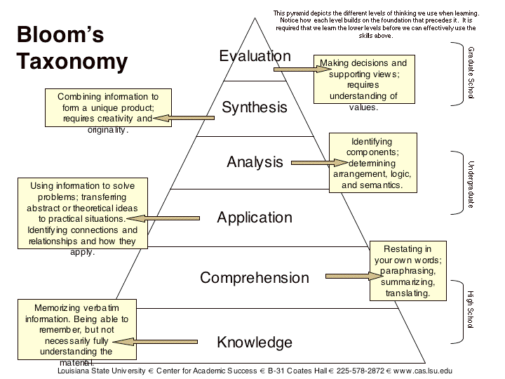
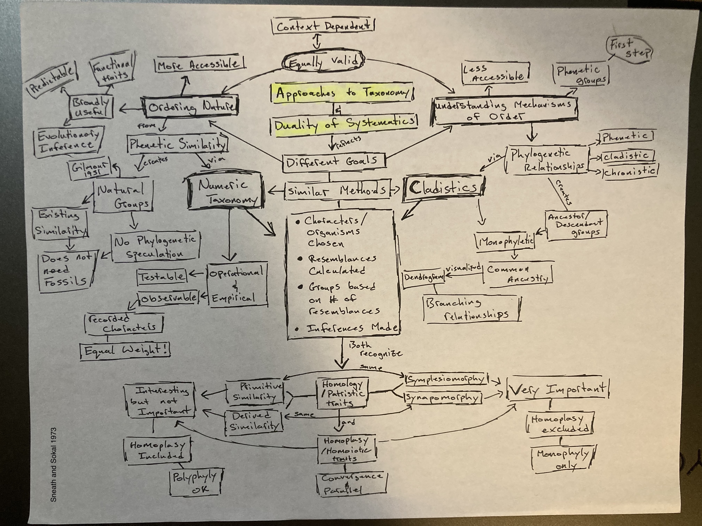

# Feb 1

### Key Innovation example (from last time)

The [evolution of the jaw](https://www.mun.ca/biology/scarr/QA_vs_DS_jaw.html) in relation to the transition from reptiles to mammals.

### Blooms Taxonomy

A different kind of taxonomy!

### B. Phenetic Taxonomy

Annotations by [Allan Larson](https://biology.wustl.edu/people/allan-larson)  

12. [Sneath, P. H. A. and R. R. Sokal (1973)](https://drive.google.com/drive/u/0/folders/1ocqMPD5gX9xi4VQy_5OtU5wSyg-X8ftM) Numerical Taxonomy. W. H. Freeman and Co., San Francisco. (Pp. 5, 9-10, 27-30).     
Excerpts from the classic work (updated version) of phenetic taxonomy, a modernist challenge to Simpsonian principles. Quantitative measurement and computation are given priority over evolutionary principles in constructing higher taxa. These excerpts give excellent definitions of important terms and the main arguments for a taxonomic system that is now largely discredited. It is perhaps the best example of how emphasis on "practicality," quantification and computation without conceptual integrity produces unsatisfactory science.

### C. Cladistic Taxonomy

12. a. [de Queiroz, K. 1988](https://drive.google.com/drive/u/0/folders/1ocqMPD5gX9xi4VQy_5OtU5wSyg-X8ftM) Systematics and the Darwinian Revolution. _Philosophy of Science_ 55:238-259.  
A strong statement of the philosophical foundations of phylogenetic systematics (cladistics). Note especially the argument that the "evolutionary taxonomy" of Mayr and Simpson fails to serve Darwinian principles because it only puts an evolutionary veneer on an essentialistic taxonomic system. Cladistic critics (especially Michael Ghiselin) use this argument to call Mayr an essentialist, knowing how much this claim upset him (compare these statements to Mayr's 1982 comments on essentialism in reading #2).

### Discussion Questions

### Concept Maps

### Sneath and Sokal 1973 Numerical Taxonomy

### de Queiroz 1988 Cladistic Taxonomy

