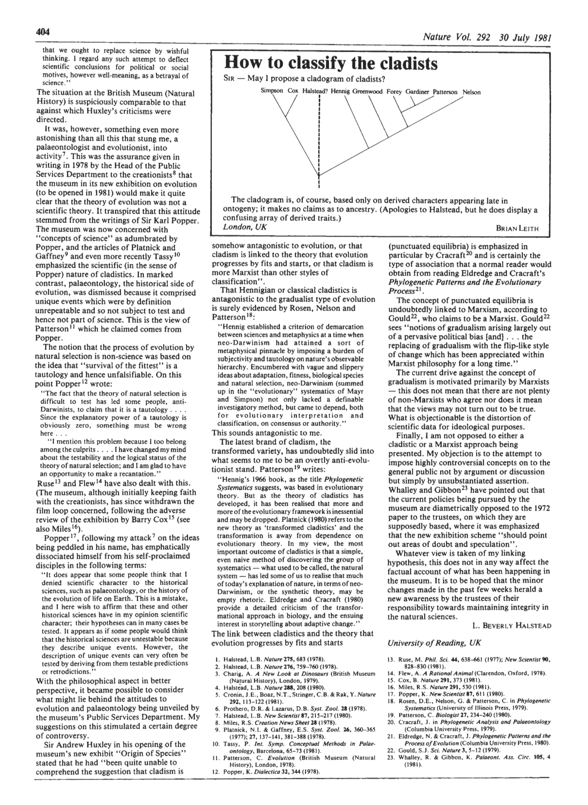

# Feb 6

### Some lingering questions from last time 

* Numerical Taxonomy (similarity methods) include ALL characters with EQUAL weight. What does this mean? How might it bias the measure of similarity?
* How would non-varying characters affect "similarity"? 

### How to Classify the Cladists

[Halstead 1981](./Halstead1981-how-to-classify-the-cladists)How to classify the cladists. Please read this very short, amusing, enlightening opinion. 

L. Beverly Healstead does a smashing job of highlighting some of the worries and debates of the day related to cladistics and evolution. Take note of cricisms of pseudoscience and falsifiability and references to Karl Popper, one of the most influential philosophers of science in the 20th century. He rejected classical inductivist views of the scientific method in favor of falsification with empirical data. Popper asserted that a theory in the empirical sciences can never be proven, but it can be falsified, and that science advances through a series of meaningful tests that advance us closer to the truth. He is often popularly quoted as saying "In so far as a scientific statement speaks about reality, it must be falsifiable; and in so far as it is not falsifiable, it does not speak about reality."

_[Aside - This one strikes some truth for me - "There is an almost universal tendency, perhaps an inborn tendency, to suspect the good faith of a man who holds opinions that differ from our own opinions. ... It obviously endangers the freedom and the objectivity of our discussion if we attack a person instead of attacking an opinion or, more precisely, a theory."]_

[More amusing Popper quotes](https://www.bookey.app/quote-author/karl-popper) 

### Cladistic Taxonomy

Annotations by [Allan Larson](https://biology.wustl.edu/people/allan-larson)  

13. [Eldredge, N. and J. Cracraft. 1980](https://drive.google.com/drive/u/0/folders/1ocqMPD5gX9xi4VQy_5OtU5wSyg-X8ftM). _Phylogenetic Patterns and the Evolutionary Process_. Columbia Univ. Press, New York.(Pp. 147-162, 165-171, 175-185). 

Eldredge aand Cracraftʻs Phylogenetic Patterns and the Evolutionary Process was an influential book that aimed to unite systematics with evolutionary theory. They use extensive paleontological evidence to support their argument, and compare and contrast phenetics, cladistics, and phylogenetics. We are reading their most controversional section on biological classification.  Also pay attention to their treatment of falsifiability and the "not-A" problem. 

Concept Map by Dani Bartz

 
### Questions:
* 

### History of Phylogenetic Methods

35. [Felsenstein, J. 2004. Chapter 10](https://drive.google.com/drive/u/0/folders/1ocqMPD5gX9xi4VQy_5OtU5wSyg-X8ftM). A digression on history and philosophy. Pp. 123-146 in Inferring Phylogenies. Sinauer Assoc., Sunderland.  **map:All**

Felsensteinʻs 2004 _Inferring Phylogenies_ is a book on the state of modern phylogentics, and which we will be reading later to understand model-based phylogenetics (Maximum Likelihood and Bayesian Inference methods, typically used for sequence data).  

Instead of reading all of the papers leading up to this or just one or two, I have decided to assign some book chapters (Felsenstein 2004) to give us a fair and rapid coverage of this important area in evolutionary biology.

The first reading from Felsentein 2004 is a historical overview (Ch. 10; we will return again to this book later in the semester when we go into the modern methods in more detail). I hope you will enjoy some of the unique and personal insights. 

#### Please focus on the methods that he walks through:   
1. What is the method?  
2. What kinds of data were used?  
3. What was the philosophy (what was being "optimized" or how was it approached?)  
4. What were the main assumptions?  
5. How did this method advance the field?  

### Questions: 
Instead of concept maps, I would like the folks listed below to be prepared to explain 1-4 above for each group of workers (just try - in some cases there is not a lot to go on in this chapter, but I can help fill in the details. I am more interested in the effort):  
* Sneath and Sokal - Danny  
* Edwards and Cavalli-Sforza - Rai  
* Camin and Sokal Parsimony - Dani  
* Eck and Dayhoff - Allison  
* Fitch and Margoliash - Danny  
* Wilson and LeQuesne - Rai  
* Jukes and Cantor - Dani  
* Farris and Kluge unordered parsiomony - Allison  
* Fitch and molecular parsiomony - Allison  

