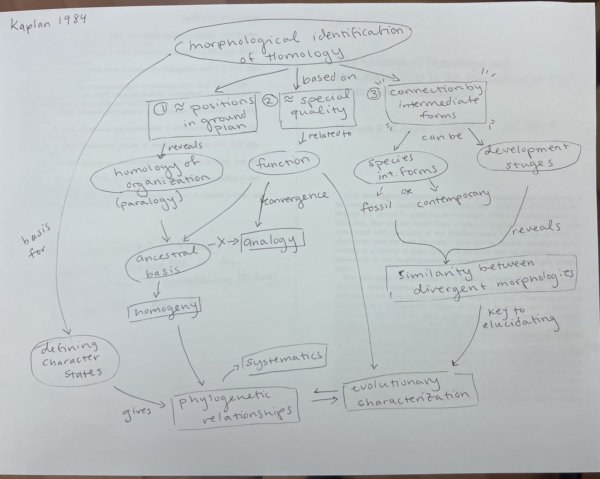
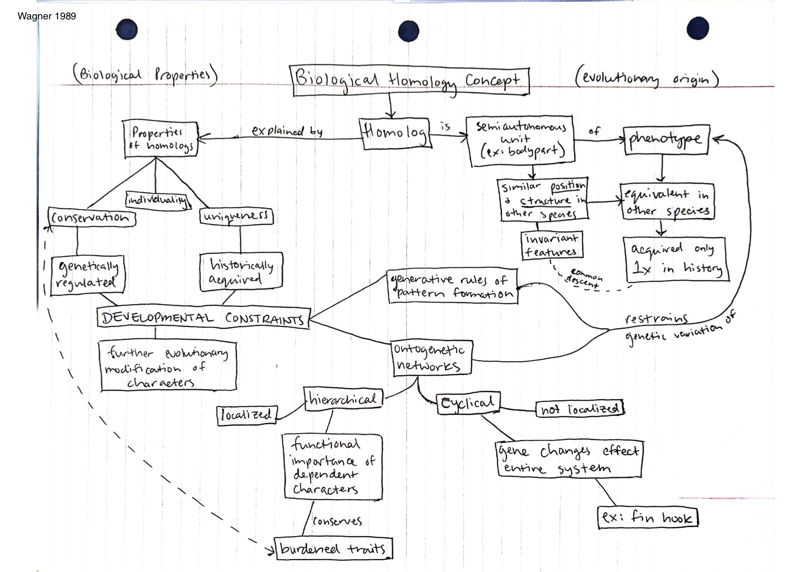

# Feb 13

## Evolutionary Morphology

### Transformational homology

Annotations by [Allan Larson](https://biology.wustl.edu/people/allan-larson)      

### 16. [Kaplan, D. R. 1984](https://drive.google.com/drive/u/0/folders/1ocqMPD5gX9xi4VQy_5OtU5wSyg-X8ftM). The concept of homology and its central role in the elucidation of plant systematic relationships. Pp. 51-70 in T. Duncan and T. F. Stuessy (eds.) _Cladistics: Perspectives on the Reconstruction of Evolutionary History_. Columbia Univ. Press, New York.   

An excellent illustration of using ontogenetic and temporal series to test hypotheses of homology among characters. It counters Patterson's argument that transformational concepts of homology are untestable. It can be viewed as an elaboration of methods for implementing Patterson's "similarity test." The formal terminology proposed regarding homology and related concepts has not been influential and should be discarded.

#### Notes
[Phyllodes](https://en.wikipedia.org/wiki/Phyllode) are modified petioles or leaf stems, which are leaf-like in appearance and function.[1] In some plants, these become flattened and widened, while the leaf itself becomes reduced or vanishes altogether. Thus the phyllode comes to serve the purpose of the leaf.

See Photo of *Acadia verticillata* by Neal Cramer here on CalPhotos.berkeley.edu:

#### Concept Map by Allison Fisher  

#### Questions:
1.  Why would Kaplan insist the word paralogy is a “needless proliferation of terms” yet suggest the use of homogeny and homoplasy? (p.53) 
2.  Do you think that taxonomists would actually approach homologies "from square one" regardless of past suggestions of relationship? (p.54)
3.  Kaplan offers some exceptions to the usefulness criteria 3 for determining homology: congenital developmental change, distinctive properties from inception, or a feature of change obscuring the fundamental structural relationship. In each of these scenarios, do you think criteria 1 and/or 2 alone would be sufficient to identify whether there is a real relationship?

### 17. [Wagner, G. P. 1989](https://drive.google.com/drive/u/0/folders/1ocqMPD5gX9xi4VQy_5OtU5wSyg-X8ftM). The origin of morphological characters and the biological basis of homology. _Evolution_ 43:1157-1171.    

Wagner's writings on homology have been critical in forming a synthesis of developmental biology and evolutionary biology. Of his various papers on homology, this one is still my favorite general overview. Pay close attention to the three fundamental properties of biological homology. How does Wagner's approach to homology differ from Patterson's?

#### Concept Map by Dani Bartz   

#### Questions:  
1. In what ways does Wagner's view of homology not align with that of convergent evolution? 
2. How is the concept of conservation discussed here similar to the concepts of parsimony, as discussed in previous readings? 

### 18. [Roth, V. L. 1991](https://drive.google.com/drive/u/0/folders/1ocqMPD5gX9xi4VQy_5OtU5wSyg-X8ftM). Homology and heirarchies: Problems solved and unresolved. _Journal of Evolutionary Biology_ 4:167-194.

My favorite paper on the hierarchical expansion of the concept of homology. It shows to my satisfaction how a character can be a valid homology in theory but still fail Patterson's congruence test. This is the phenomenon recognized in molecular evolution as "lineage sorting," derived here in a general sense. "Genetic piracy" of homologies is another important concept central to understanding the relationship between ontogeny and phylogeny.

#### Concept Map by Rai Malayaj   

#### Questions:  

