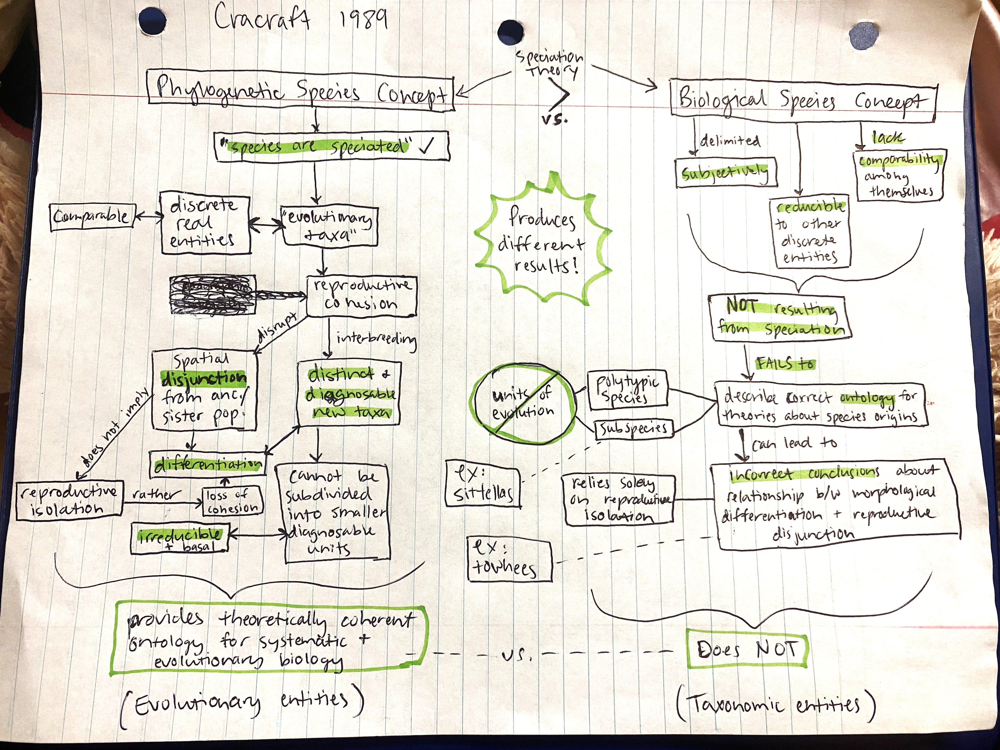
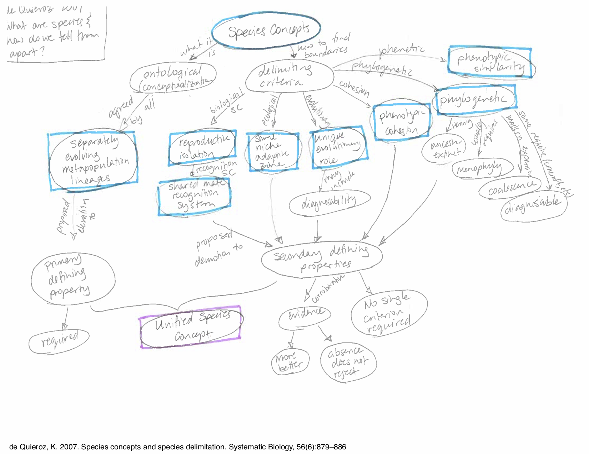

# Feb 15 and Feb 20

## Species Concepts

This is just a few of the many species concepts. Other prominent concepts are listed at the bottom FYI.

Annotations by [Allan Larson](https://biology.wustl.edu/people/allan-larson)      

### Essentialism, Typology, and the Biological Species Concept (already read)

10. [Mayr, E. 1987](https://drive.google.com/drive/u/0/folders/1ocqMPD5gX9xi4VQy_5OtU5wSyg-X8ftM). The Ontological Status of Species: Scientific Progress and Philosophical Terminology. _Biology and Philosophy_ 2(1987)145--166.  **We already read this paper**

The philosophical question of whether species are classes, individuals or populations is an important one affecting all concepts of species and evolutionary theory in general (punctuated equilibrium and the hierarchical expansion of selection theory rely on the argument that species are individuals, for example). Mayr (1987) presents a clear coverage of this issue, and defends his biological species concept against criticism in this important paper. Ultimately, the issue was refined by the “general lineage concept” in which species are segments of population lineages (de Queiroz 1999).

#### Concept Map by Dani Bartz  

### Recognition Species Concept

32. [Paterson, H. E. H. 1985](https://drive.google.com/drive/u/0/folders/1ocqMPD5gX9xi4VQy_5OtU5wSyg-X8ftM). The recognition concept of species. _Transvaal Museum Monograph_ 4:21-29. 

A critique of the biological species concept emphasizing the species as a philosophical individual and important level of complexity in the genealogical hierarchy of life. This concept involves strong criticism of nonallopatric mechanisms for formation of species.

#### Concept Map by Danny Cusimano  

####Questions 

1. Does the Recognition Concept solve the question of Isolating Mechanisms and therefor fit within the scope of the Isolation Concept? Besides species delineations based solely on allopatry (and therefor still sharing a fertilization system), where does this concept conflict with the BSC?

2. Sympatric speciation is not discussed here. Does Paterson believe that speciation is only possible in allopatry? 

### Phylogenetic Species Concept 

33. [Cracraft, J. 1989](https://drive.google.com/drive/u/0/folders/1ocqMPD5gX9xi4VQy_5OtU5wSyg-X8ftM). Speciation and its ontology: The empirical consequences of alternative species concepts for understanding patterns and processes of differentiation. Pp. 28-59 in D. Otte and J. A. Endler (eds.) _Speciation and its Consequences_. Sinauer Assoc., Sunderland. **map:Dani**

A concept designed to be optimal for reconstructing the phylogenetic history of life in the finest possible detail, especially with respect to biogeographical and conservational issues. This concept has gained numerous followers, who nonetheless have numerous disagreements among themselves regarding criteria of diagnosability. This paper is probably the most thorough general statement of the phylogenetic species concept.

#### Concept Map by Dani Bartz  

#### Questions:
1. Compare the BSC vs. the phylogenetic species comcept with regard to testability.  What are problems with a reliance on reproductive isolation? Do you believe the PSC is superior? In what ways?
2. Contrast the uses and usefulness of the two species concepts.   

### [Feb 20]

### Species Delimitation and Reconciliation of Species Concepts 

34. de Quieroz, K. 2007. Species concepts and species delimitation. *Systematic Biology*, Volume 56, Issue 6, December 2007, Pages 879–886, <https://doi.org/10.1080/10635150701701083>. **map:Marguerite**

An ambitious attempt to place all of the preceding concepts into a common conceptual framework recognizing important contributions from all of the concepts. Many recent papers invoke this concept as the basis for discussions of species and speciation. I interpret the argument basically as a statement that the ontological status of a species is a segment of a population lineage.

#### Concept Map by Marguerite Butler  

#### Questions:
1. Why does de Quieroz differentiate between metapopulations, species, separately evolving lineages, and "segments" of such lineages?
2. Do we expect the different species concepts to disagree on species delimitation only in the "disagreement zone" (during the process of speciation), or could they disagree after say millions of years of separation? Is this a problem?
3. Explain the reasoning behind no single secondary defining property is required, and rejection of no single property does not refute species status. Are there situations where no property would provide support? 

### Additional Concepts (just FYI, we are not reading these papers)

#### Evolutionary Species Concept

Wiley, E. O. 1981. Phylogenetics. Wiley & sons, New York. (Pp. 24-34)

An update of Simpson's evolutionary species concept, which explicitly defines species as having a temporal dimension. It is often called a "lineage concept" of species to distinguish it from concepts that consider species only at a single moment in time (biological and recognition concepts, for example), although this distinction is debated.

#### Cohesion Species Concept

Templeton, A. R. 1989. The meaning of species and speciation - a genetic perspective. Pp. 3-27 in D. Otte and J. A. Endler (eds.) Speciation and its Consequences. Sinauer Assoc., Sunderland.

A revision of the evolutionary species concept designed to make population genetic principles more explicit conceptually and to provide greater testability.

#### Genetic Concept of Species

Baker, R. J. and R. D. Bradley. 2006. Speciation in mammals and the genetic species concept. Journal of Mammalogy 87:643-662.

A concept that preserves many goals of the phylogenetic species concept but which explicitly acknowledges population genetic studies of haplotype variation for multiple loci.

#### General Lineage Concept of Species

de Queiroz, K. 1999. The general lineage concept of species and the defining properties of the species category. Pp. 49-89 in R. A. Wilson (eds.) Species: New Interdisciplinary Essays. MIT Press, Cambridge, MA.

