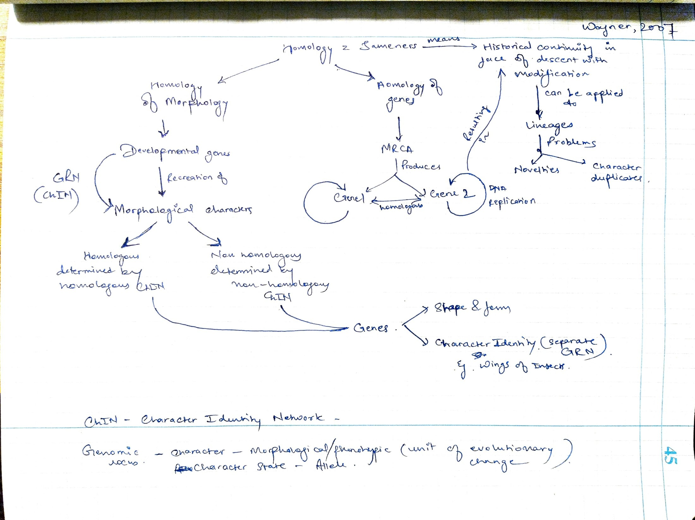
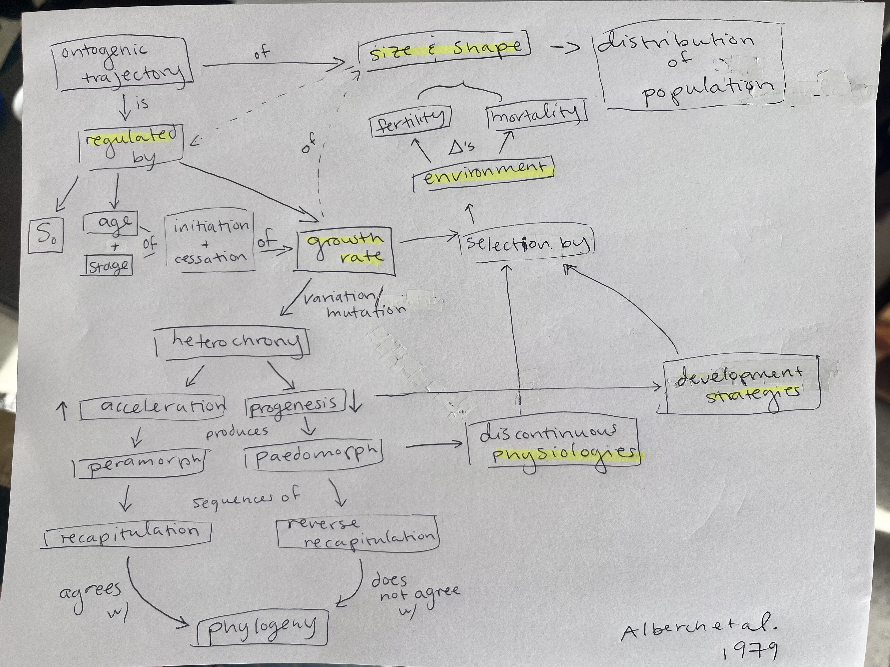

# Feb 27

## Evolutionary Morphology 

### A. Ontogeny and Phylogeny I: Heterochrony and Ontogenetic Repatterning

Annotations by [Allan Larson](https://biology.wustl.edu/people/allan-larson)  

*Axylotyl ganz* or "Mexican Walking Fish" From [LoKiLeCh](https://de.wikipedia.org/wiki/Benutzer:LoKiLeCh), Wikipedia Commons  

_Necturus maculosus_ or "common mud puppy"

_Cryptobranchus alleganiensis_ or "hellbender"

### 19. [Wagner, G. P. 2007](https://drive.google.com/drive/u/0/folders/1ocqMPD5gX9xi4VQy_5OtU5wSyg-X8ftM). The developmental genetics of homology. _Nature Reviews Genetics_ 8:473-479.    

Exploration of the hierarchical structure of homology, including the relationship between morphological homology and the structures of genetic systems. Pay close attention to the meanings of character identity networks (ChINs) and gene regulatory networks (GRNs).

#### Concept Map by Rai Malayaj   

#### Questions 

1. Why are character identities and character states regulated by different Gene regulatory networks? Does it provide any advantages in regards to evolution?
2. How can we tackle the problem of novelty in morphological or genetic states? Can these novelties be assessed in terms of homology, if not then how can we consider them evolutionary?

### 20. [Alberch, P., S. J. Gould, G. F. Oster and D. B. Wake. 1979](https://drive.google.com/drive/u/0/folders/1ocqMPD5gX9xi4VQy_5OtU5wSyg-X8ftM). Size and shape in ontogeny and phylogeny. _Paleobiology_ 5:296-317.   

A classic paper giving formal definitions of the standard patterns and processes of heterochrony, especially as relevant to changes occurring relatively late in ontogeny (retroactively termed "de Beerian heterochrony" by many authors). This is the standard scheme against which others are compared.

__Haeckelʻs Biogenetic law (1866)__ "Ontogeny recapitulates phylogeny"
- Coined the term "heterochrony" to indicate deviations from the Biogenetic law. 

__Heterochrony:__ The evolutionary change in the timing of development.

__Von Bayerʻs Four laws of embryology (1828):__
1. […] the more general characters of a large group appear earlier in the embryo than the more special characters.
2. From the most general forms the less general are developed, and so on, until finally the most special arises.
3. Every embryo of a given animal form, instead of passing through the other forms, rather becomes separated from them.
4. Fundamentally, therefore, the embryo of a higher form never resembles any other form, but only its embryo. 

__SJ Gould (1977)__ "Ontogeny and Phylogeny" 
- Argues that you can get punctuated change through evolutionary changes in development "Saltational change"

#### Concept Map by Allison Fisher   

#### Questions 

1. What is size and shape referring to? Can the ideas related to development of size and shape be applied to other features besides physical volume/form?
2. Do you think any one factor is universally most influential on size and shape or does this vary by organism and even individual?
3. How can change in developmental timing result in reproductive isolation? Is this process easily distinguishable from slow morphological shifts (phyletic gradualism) in life?

