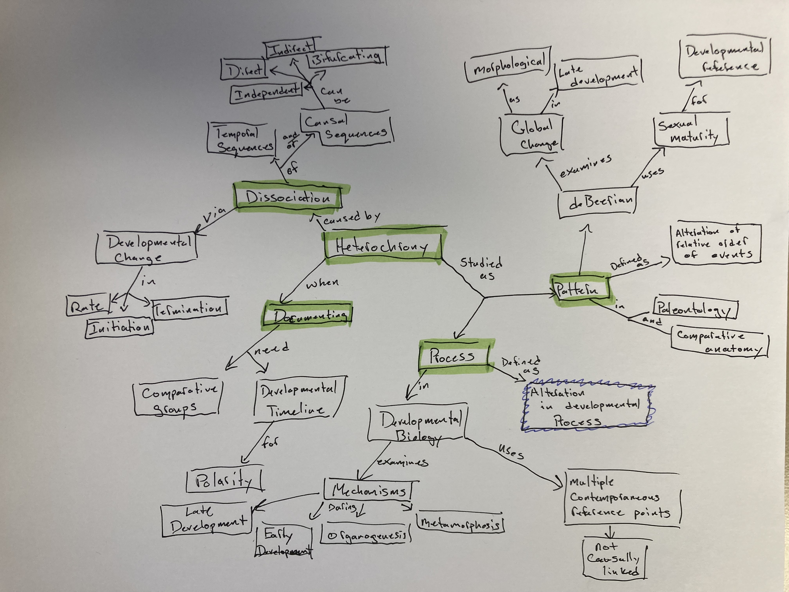
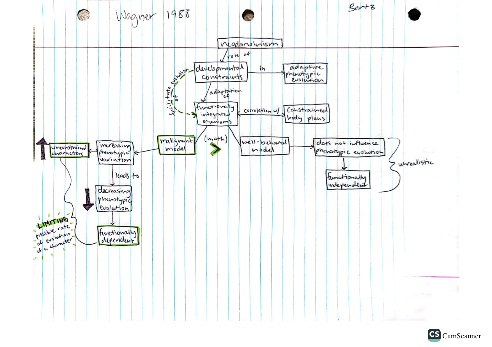

# Feb 29

## Evolutionary Morphology 

### B. Modularity and Genetic Architecture

Annotations by [Allan Larson](https://biology.wustl.edu/people/allan-larson)  

### 21. [Raff, R. A. and G. A. Wray. 1989](https://drive.google.com/drive/u/0/folders/1ocqMPD5gX9xi4VQy_5OtU5wSyg-X8ftM) Heterochrony: Developmental mechanisms and evolutionary results. Journal of Evolutionary Biology 2:409-434.    

An important paper showing that the standard categorization of heterochronic patterns and processes (Galis 2001) is difficult to apply to early ontogeny and/or between hierarchical levels (organismal morphology versus gene expression).

#### Concept Map by Danny Cusimano   

#### Questions 

1. In broadening the definition of heterochrony, Raff and Wray point out that morphological heterochrony is not necessarily achieved through timing changes in development. For cases such as these (e.g., the Axolotl), would we need a new definition for the observed condition? Is morphological heterochrony caused by non-timing mechanisms still heterochrony? Further, is their assessment of these conditions wholly valid? Wouldn't the hormonal change in Axolotl development still count as a mechanism of Termination? 

2. The authors suggest that Heterochrony might be the predominant mode of evolutionary change. They follow by saying that this question is "likely to remain unanswered for some time". Where do we stand on this today? 

### 22. [Wagner, G. P. 1988](https://drive.google.com/drive/u/0/folders/1ocqMPD5gX9xi4VQy_5OtU5wSyg-X8ftM) The significance of developmental constraints for phenotypic evolution by natural selection. Pp. 222-229 in G. de Jong (ed.) Population Genetics and Evolution, Springer-Verlag, Berlin.

The first paper to show that developmental constraints could enhance rather than just inhibit adaptive evolution by natural selection. This paper was critical in the synthesis of structuralist and functionalist approaches to the study of form, and made the concept of developmental constraint more accessible to hardcore Darwinians. Note the structure of the corridor models of adaptation.

#### Concept Map by Dani Bartz  

#### Questions 

1. What do you think are some examples of unconstrained characters and how may these have played a part in the phenotypic variation of that species? (Think about extinct species because the phenotypic evolution of them would have decreased)

2. Can you think of any related groups in which one has one character fixed and in the other it's variable?

