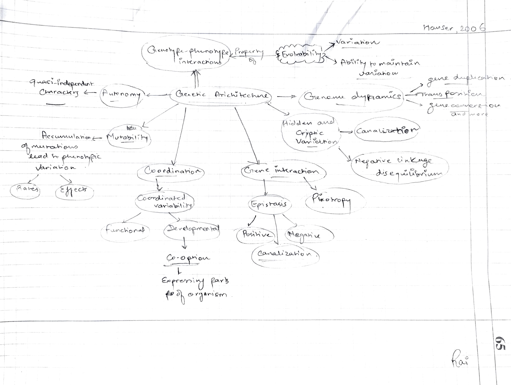
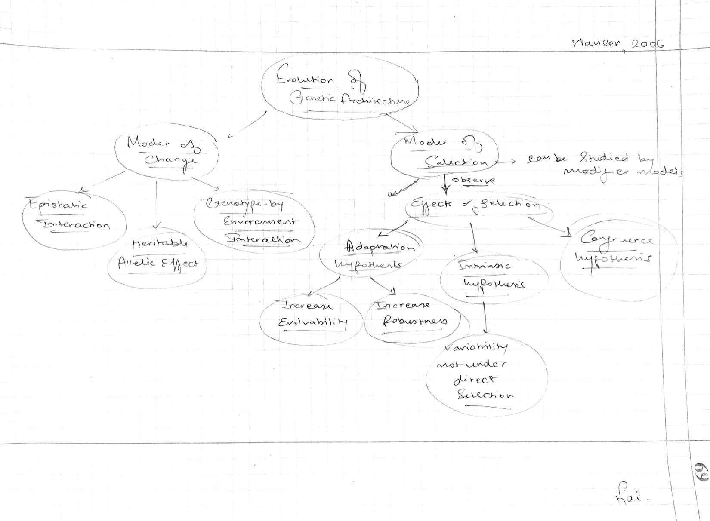
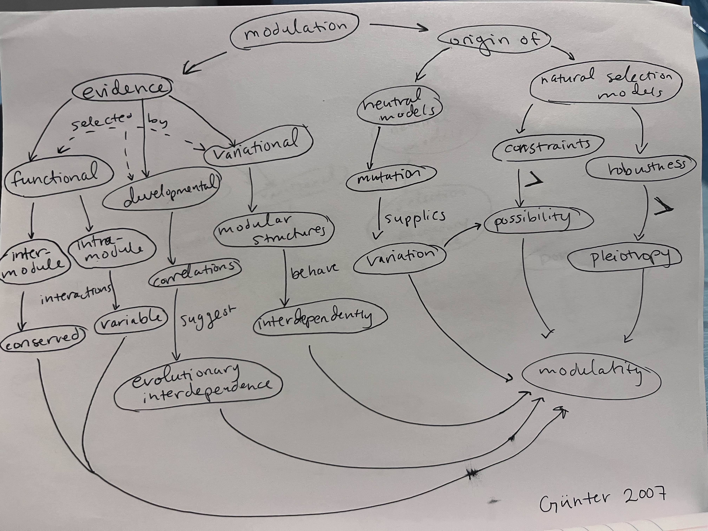

# March 5

## Evolutionary Morphology 

### C. Evolution of Genetic Architecture 

Annotations by [Allan Larson](https://biology.wustl.edu/people/allan-larson)  

### 23. [Hansen, T. F. 2006](https://drive.google.com/drive/u/0/folders/1ocqMPD5gX9xi4VQy_5OtU5wSyg-X8ftM) Evolution of genetic architecture. Annual Review of Ecology, Evolution and Systematics 37:123-157.  

The concept of genetic architecture and its evolution is important both to issues of evolvability (the next topic) and speciation by genetic transilience. This is a precise and thoughtful treatment. Careful attention to the main concepts of this paper will be rewarded in upcoming topics.

#### Concept Map by Rai Malayaj   

#### Questions 

1. What are evolutionary capacitors and how do they expose cryptic variation?

2. Does robustness correspond to dominance of an allele? Does it help in increasing evolvability of an organism or it limits the evolvability?

### 24. [Wagner, G. P., M. Pavlicev and J. M. Cheverud. 2007](https://drive.google.com/drive/u/0/folders/1ocqMPD5gX9xi4VQy_5OtU5wSyg-X8ftM) The road to modularity. Nature Reviews Genetics 8:921-931. 

A thoughtful and important coverage of the critical concept of modularity in evolution. Modularity is one of the key concepts underlying a proposed extended evolutionary synthesis to incorporate development and morphology into evolutionary theory.

#### Concept Map by Allison Fisher  

#### Questions 

1. Do you think modulation is only an advanced feature of evolution or could it be necessarily ancestral in the making of life forms?

2. Can you think of a situation where aspects of modularity do interact with the environment? Or is the concept strictly abstract?

3. Without modularity, could the same level of variability that we see today be achieved? Would extreme variability or obligate robustness be a more *limiting restraint on evolution*?

