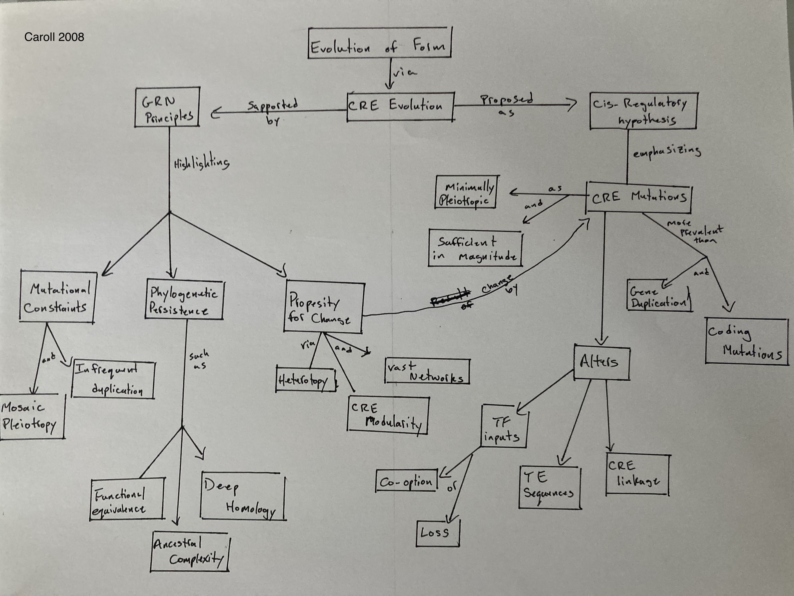
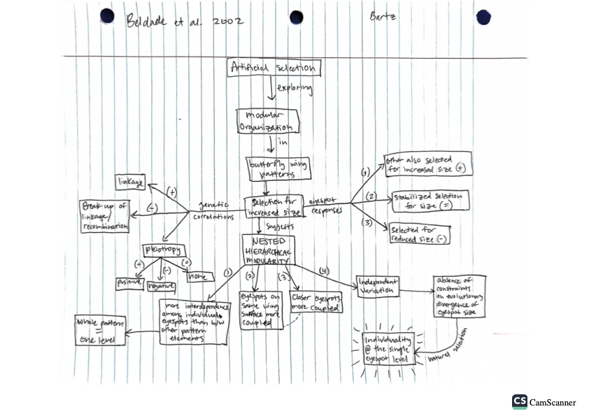

# March 7

## Evolutionary Morphology 

### D. Evo Devo and the Genetics of Adaptation 

Annotations by [Allan Larson](https://biology.wustl.edu/people/allan-larson)  

### 25. [Carroll, S. B. 2008](https://drive.google.com/drive/u/0/folders/1ocqMPD5gX9xi4VQy_5OtU5wSyg-X8ftM) Evo-devo and an expanding evolutionary synthesis: a genetic theory of morphological evolution. Cell 134:25-36.  **map:Danny**

A good summary of the contributions of evolutionary developmental biology to an expanded evolutionary theory. Note specifically this author’s emphasis on cis-regulation at the level of gene expression, a claim that has generated controversy. The author is a very influential evolutionary biologist and a former Washington University undergraduate.

#### Concept Map by Danny Cusimano   

#### Questions 

1. What is the significance of "deep homology" (revealing homologous GRNs in non-homologous structures) for our understanding and definition of Homology? What would the authors of our previous readings on the subject say (Patterson, de Queiroz, Kaplan, Wagner, and Roth)? 

2. The insufficiency of Gene Duplication and Coding Errors is an important theme of this paper. Is this specific only to large scale morphological change? When then do these types of mutations become more significant for evolutionary change? 

3. When discussing the Remodelling of CREs (pg. 33), is the author considering heterochronic changes? Is such developmental change (particularly in rate) a reflection of strengthening or weakening regulatory linkages?

### 26. [Beldade, P., Koops, K., and Brakefield, P. M. 2002](https://drive.google.com/drive/u/0/folders/1ocqMPD5gX9xi4VQy_5OtU5wSyg-X8ftM) Modularity, individuality, and evo-devo in butterfly wings. PNAS 99(22):14262-14267 https://doi.org/10.1073/pnas.222236199   

#### Concept Map by Dani Bartz  

#### Questions 

1. What do you think would occur if they continued this experiment for many more generations (say 100, or 1000)? Would you expect eyespot size to be the only characteristic to change or do you think eventually a change may be observed in other traits such as eyespot shape (more morphologically diverse than current) or color? Why?

2. Discuss the role of the linkage (or break up  of linkage) between eyespot regulating alleles. Why do you think the uncoupling directions (for example A-P+) produce some of the more drastic results? 

