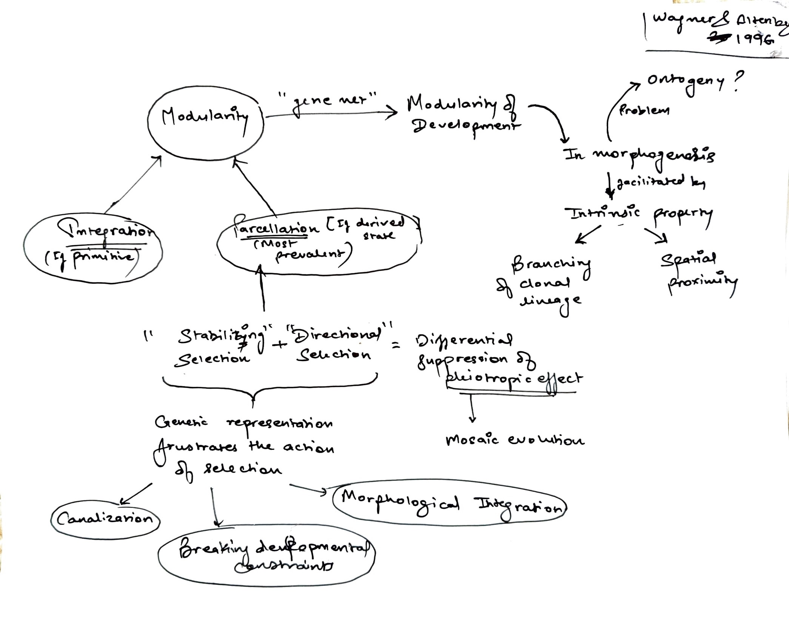

# March 12

## Evolutionary Morphology 

### E. The Evolution of Evolvability 

### 27. [Wagner, G. P., Altenberg, L. 1996](https://drive.google.com/drive/u/0/folders/1ocqMPD5gX9xi4VQy_5OtU5wSyg-X8ftM) Perspective: Complex adaptations and the evolution of evolvability. Evolution 50(3):967-967.  **map:Rai** 

A very interesting and thought provoking paper on evolvability, evo-devo, and computational biology. Lee Altenberg is a theoretical biologist at UH in ICS.

#### Concept Map by Rai Malayaj   

#### Questions 

1. Does modularity affect variability in order to produce variations? Or what is the relation between modularity and variability.

2. How does variability restrict adaptations and what sets the Optima within constrained space of variability?

3. Is parcellation a result of canalization?

### 28. [Mallarino, R., Grant, P. R., Grant, B. R., Herrel, A., Kuo, W. P., Abzhanov, A. 2011](https://drive.google.com/drive/u/0/folders/1ocqMPD5gX9xi4VQy_5OtU5wSyg-X8ftM) Two developmental modules establish 3D beak-shape variation in Darwinʻs finches. PNAS 108(10):4057–4062. https://doi.org/10.1073/pnas.1011480108  

#### Concept Map by Allison Fisher  

#### Questions 

1. In the second to last paragraph, they cite previous evidence that beak length is less strongly correlated than depth and width are. Does this agree with this paper’s findings about which genes express positive control over each axis of beak dimension?

2. If development of prenasal cartilage is necessary to precede premaxillary bone expansion, are they truly interdependent? Or is this modularity more hierarchical? 

