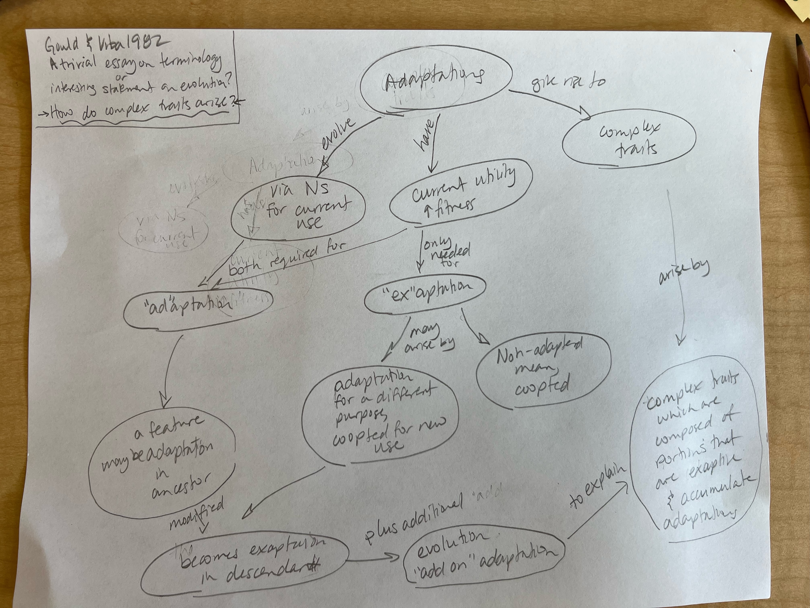

# March 14

## Key Innovations  

Annotations by [Allan Larson](https://biology.wustl.edu/people/allan-larson)  

### 30. [Galis, F. 2001](https://drive.google.com/drive/u/0/folders/1ocqMPD5gX9xi4VQy_5OtU5wSyg-X8ftM). Key innovations and radiations. Pp. 581-605 in G. P. Wagner (ed.) The Character Concept in Evolutionary Biology. Academic Press, San Diego.  **map:Danny**

A good review of uses of "key innovation" in evolution, including criticism of some widespread misuses.

#### Concept Map by Danny Cusimano   

#### Questions 

1. Galis suggests that testing traditional definitions of Key Innovations is difficult due to 1) lack of suitable comparative taxa and 2) circularity in definitions (similar to homology arguments). In suggesting that such innovations (by the new definition) "should turn up at low nodes in phylogenetic reconstructions", does Galis fall into the same circularity trap? If this is not offered as a means to test for key innovations, is there a test available? Does it need to be tested?

2. Galis highlights the difficulty of categorizing key innovations in behavior and suggests that it is currently only possible with respect to their effect on niche width. Can we explore ways in which behavioral innovations might be more visible/measurable? As an anthropologist I can't help but to consider tool use and controlled fire as behavioral innovations observable in the fossil (archaeological) record.

### 31. [Jablonski, D. 2005](https://drive.google.com/drive/u/0/folders/1ocqMPD5gX9xi4VQy_5OtU5wSyg-X8ftM). Evolutionary innovations in the fossil record: The intersection of ecology, development and macroevolution. Journal of Experimental Zoology 304B:504-519.  **map:Dani**

Influential work suggesting that evolutionary novelties associated with origins of higher taxa occur preferentially in highly disturbed environments in the marine fossil record. Cracraft (1990) is highly critical of these arguments.

#### Concept Map by Dani Bartz   

#### Questions 

1. Discuss the environmental patterns or factors that you think could've played a role in those of the onshore-originated species that moved exclusively to the deep sea over time? What kind of adaptations do you think would be necessary for such a stark contrast in habitat? 

2. Why do you think the lower taxonomic groups lacked this onshore-origination bias? 

3. What do you think are some examples of the "evolutionary novelties" discussed here? 

### 34. [Gould, S.J., Vrba, E.S. 1982](https://drive.google.com/drive/u/0/folders/1ocqMPD5gX9xi4VQy_5OtU5wSyg-X8ftM). Exaptation-A missing term in the science of form. Paleobiology. 8(1):4-15. **map:Marguerite**

#### Concept Map by Marguerite Butler  

#### Questions 

1. Do we really need to "exaptation" to explain complex traits? What are the issues if we do not?

