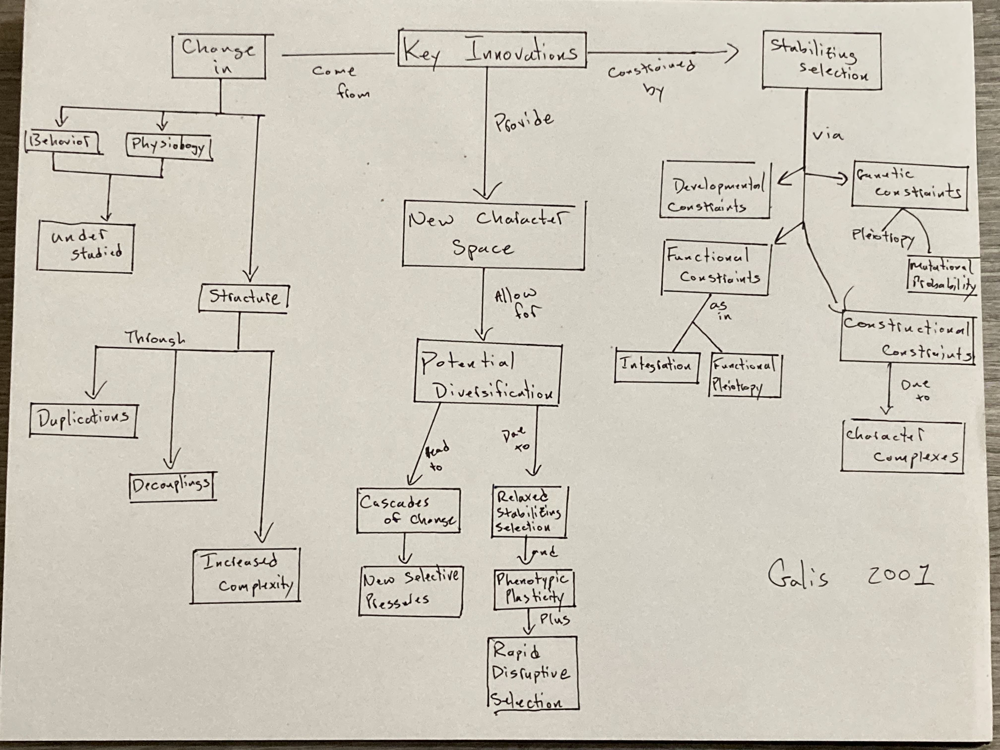

# March 14

## Key Innovations  

Annotations by [Allan Larson](https://biology.wustl.edu/people/allan-larson)  

### 30. [Galis, F. 2001](https://drive.google.com/drive/u/0/folders/1ocqMPD5gX9xi4VQy_5OtU5wSyg-X8ftM). Key innovations and radiations. Pp. 581-605 in G. P. Wagner (ed.) The Character Concept in Evolutionary Biology. Academic Press, San Diego.  **map:Danny**

A good review of uses of "key innovation" in evolution, including criticism of some widespread misuses.

#### Concept Map by Danny Cusimano   

#### Questions 

1. 

### 31. [Jablonski, D. 2005](https://drive.google.com/drive/u/0/folders/1ocqMPD5gX9xi4VQy_5OtU5wSyg-X8ftM). Evolutionary innovations in the fossil record: The intersection of ecology, development and macroevolution. Journal of Experimental Zoology 304B:504-519.  **map:Dani**

Influential work suggesting that evolutionary novelties associated with origins of higher taxa occur preferentially in highly disturbed environments in the marine fossil record. Cracraft (1990) is highly critical of these arguments.

#### Concept Map by Danny Cusimano   

#### Questions 

1. 

### 34. [Gould, S.J., Vrba, E.S. 1982](https://drive.google.com/drive/u/0/folders/1ocqMPD5gX9xi4VQy_5OtU5wSyg-X8ftM). Exaptation-A missing term in the science of form. Paleobiology. 8(1):4-15. **map:Marguerite**

#### Concept Map by Marguerite Butler  

#### Questions 

1. 

