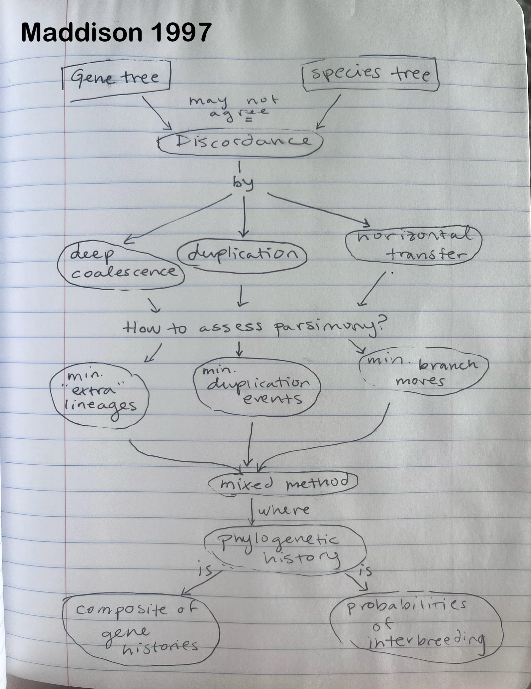
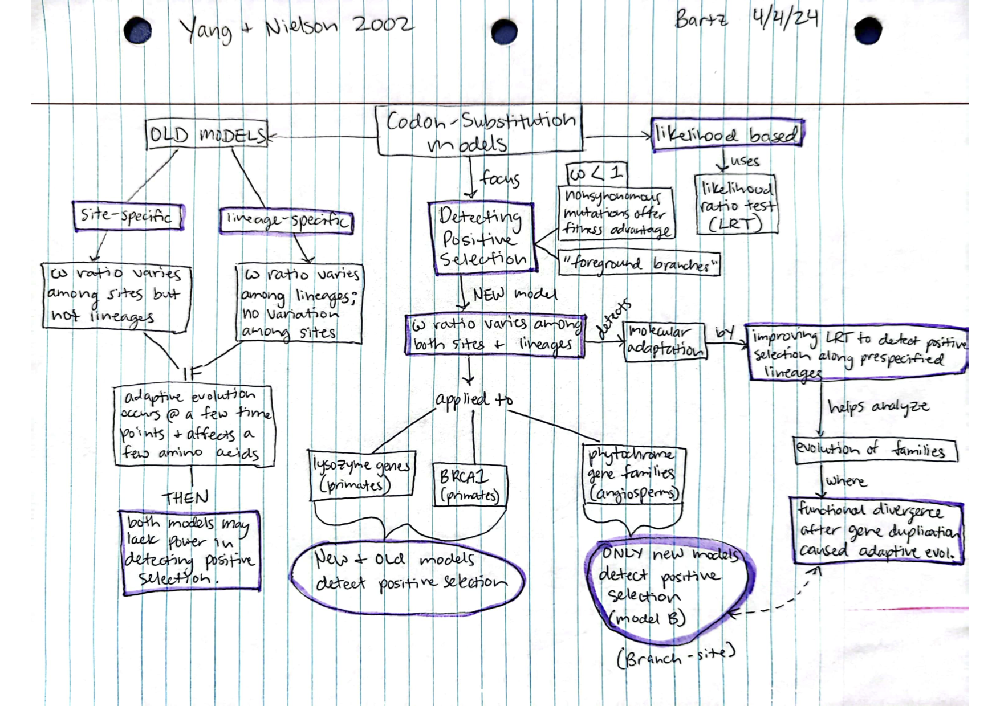

# April 4

## Bayesian Methods, Gene Trees, and Molecular Adaptation  

### 42. [Maddison, W. P. 1997](https://drive.google.com/drive/u/0/folders/1ocqMPD5gX9xi4VQy_5OtU5wSyg-X8ftM) Gene trees in species trees. Systematic Biology 46(3):523-536  

#### Concept Map by Allison Fisher   

#### Questions

1. Can we know the “true” species tree without using gene trees?

2. Is it inhibiting to try to consider all of the possible gene histories and discordance processes in constructing a phylogeny? If so, how many do you think would be sufficient to construct a functional phylogeny?

3. How can we apply Bayesian theory to gene trees in species trees? What would be considered the data?

### 43. [Drummond, A. J., Nicholls, G. K., Rodrigo, A. G., and Solomon, W. 2002](https://drive.google.com/drive/u/0/folders/1ocqMPD5gX9xi4VQy_5OtU5wSyg-X8ftM) Estimating Mutation parameters, population history and geneaology simultaneously from temporally spaced sequence data. Genetics 161:1307-1320.  **map:Rai**  

### 44. [Yang, Z., Nielsen, R. 2002](https://drive.google.com/drive/u/0/folders/1ocqMPD5gX9xi4VQy_5OtU5wSyg-X8ftM) Substitution models for detecting molecular adaptation at individual sites along specific lineages. Mol. Biol. Evol. 19(6):908-917.   **map:Dani**  

#### Concept Map by Dani Bartz   

#### Questions 

1. What are some of the parameters or qualities of branch-site Model B that makes it fit the data better than the other models? Which dataset did it fit the best?

2. The authors stated that the branch-site models from this paper could identify positively selected sites when they exist using Bayes prediction, but then later mentioned that typical data sets may not contain enough information for Bayes prediction to be reliable and that it wouldn't offer much advantage over simple ancestral sequence reconstruction. Do you think that Bayes prediction plays a necessary role here, or is it not necessary?

