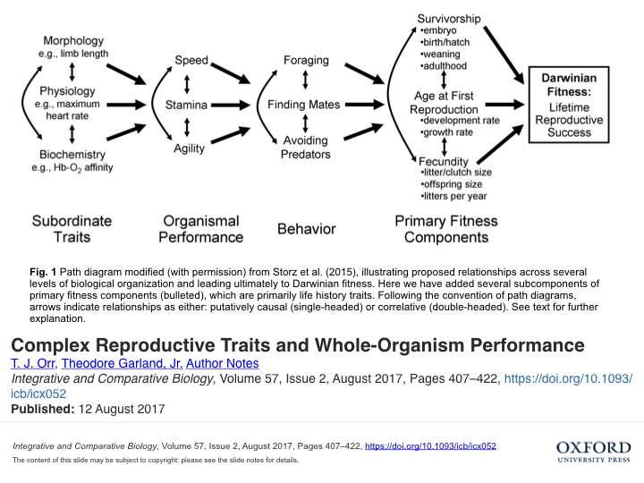
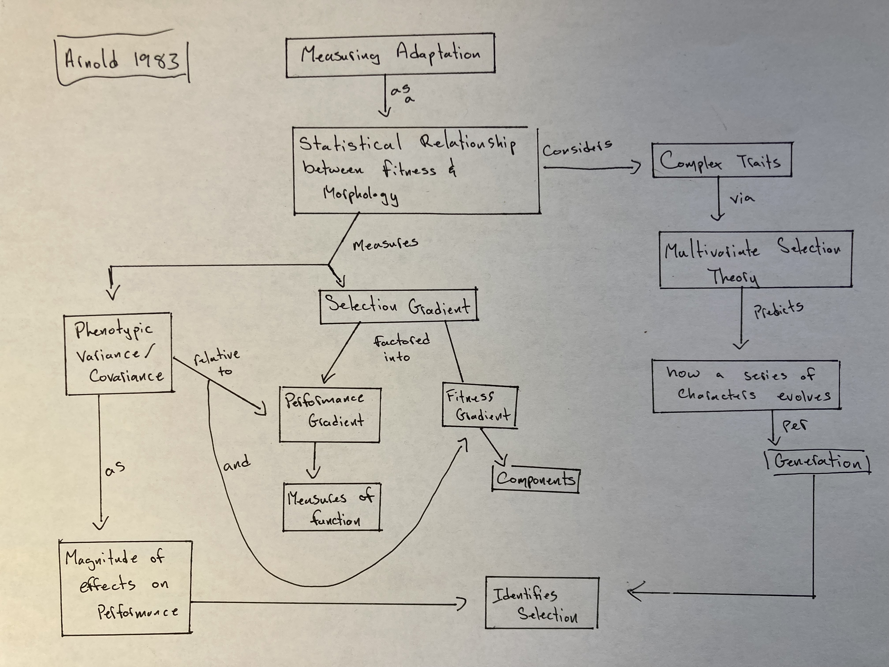
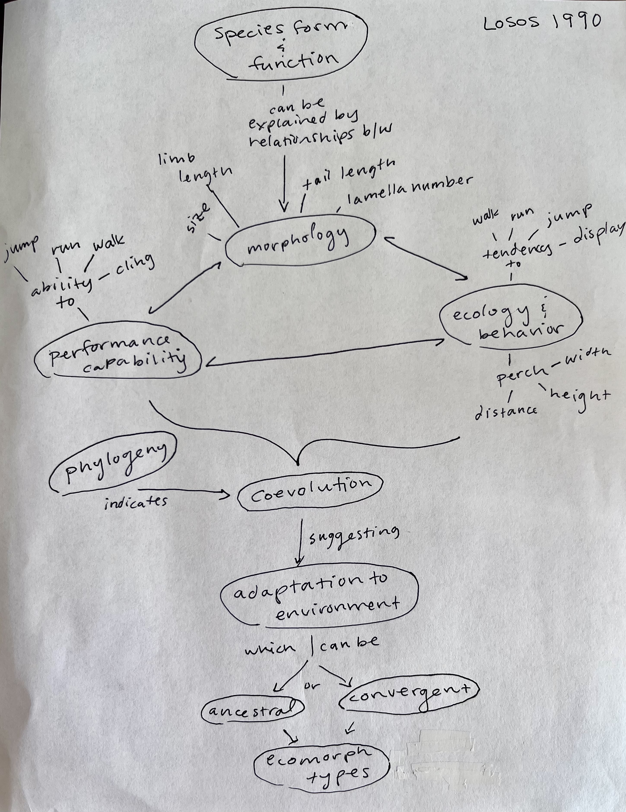

# April 9

## Comparative approaches to Adaptation and Ecomorphology  

The comparative approach (comparing the phenotypes of species that differ in ecology or some other interesting way) has a long history in the study of Adaptation. But as you recall, there was strong criticism of "adaptationist" approaches.  Arnold (1983) wrote a very influential symposium paper on a phenotypic approach to the study of adaptation that brought rigor and testability to the problem. The idea of Morphology -> Performance -> Fitness led to the field of "Ecomorphology". One of the best early examples of the implementation of ecomorphology was Losos (1990), which he did within a phylogenetic context.

45. [Arnold, S. J. 1983.](https://drive.google.com/drive/u/0/folders/1ocqMPD5gX9xi4VQy_5OtU5wSyg-X8ftM) Morphology, Performance, and Fitness. American Zoologist 23:347-361.  **map:Danny**  

#### Morphology, Performance, Fitness Path Diagram

#### Concept Map by Danny Cusimano   

#### Questions

1. 

46. [Losos, J. B. 1990.](https://drive.google.com/drive/u/0/folders/1ocqMPD5gX9xi4VQy_5OtU5wSyg-X8ftM) Ecomorphology, performance capability, and scaling of West Indian Anolis lizards: an evolutionary analysis. Ecological Monographs, 60(3):369-388.    **map:Allison** 

#### \[[Anolis Adaptive Radiation](./AnolisAdaptiveRadiation.pdf)\]

#### Concept Map by Allison Fisher   

#### Questions

1. Do these ideas indicate that species diversity can be explained by amount of diversity in the environment?

2.  Why is it important to distinguish between performance capability and actual ecobehavior?