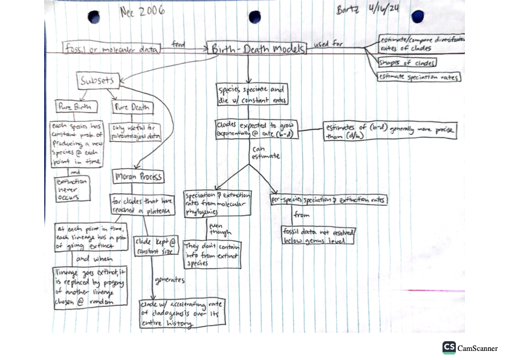
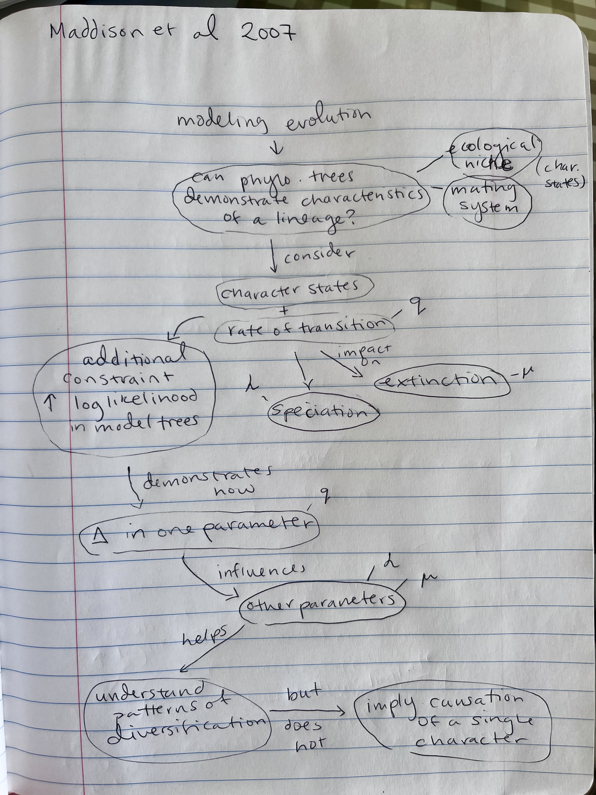

# April 16

We will pick up from last time starting with Butler and King 2004

[see 48.Intro to Comparative Methods powerpoint](https://drive.google.com/drive/u/0/folders/1ocqMPD5gX9xi4VQy_5OtU5wSyg-X8ftM)

## Diversity through time  

49. [Nee, S. 2006](https://drive.google.com/drive/u/0/folders/1ocqMPD5gX9xi4VQy_5OtU5wSyg-X8ftM) Birth-death models in macroevolution. Ann. Rev. Ecol. Evol. Syst. 37:1-17. DOI: 10.1146/annurev.ecolsys.37.091305.110035    

#### Concept Map by Dani Bartz  

#### Questions

1. What are some hypotheses (or your own speculations) for the remarkably high speciation rate of Hawaiian silverswords?

2. At the top of p. 7, Nee indicates that we would expect the future lifetime of a species to be independent of how long it has been around already. Do you agree with this and why or why not? 

51. [Maddison, W. P., Midford, P. E., Otto, S. P. 2007](https://drive.google.com/drive/u/0/folders/1ocqMPD5gX9xi4VQy_5OtU5wSyg-X8ftM) Estimating a binary character's effect on speciation and extinction. Systematic Biology 56(5):701-710.  (substitute for Quasse FitzJohn paper)  **map:Allison**   

#### Concept Map by Allison Fisher  

#### Questions

1. What sorts of characters might increase rate of speciation? Extinction?

2. What are some of the limitations of this method? 

