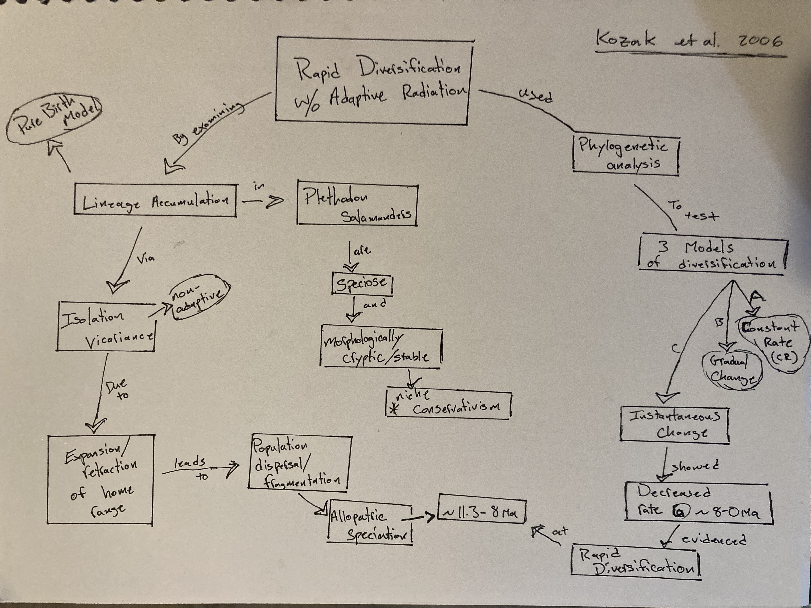

# April 18

We will pick up from last time starting with Maddison, Midford and Otto 2007

## Diversity through time  

### 52. [Kozak, Weisrock, Larson A. 2006](https://drive.google.com/drive/u/0/folders/1ocqMPD5gX9xi4VQy_5OtU5wSyg-X8ftM). Rapid lineage accumulation in a non-adaptive radiation: phylogenetic analysis of diversification rates in eastern North American woodland salamanders (Plethodontidae: _Plethodon_)  
#### Concept Map by Danny Cusimano  

#### Questions

1. Given the time depth for the period of rapid divergence (~11-8 Ma), is it possible that some of these lineages did adapt to different conditions and that the similarity we currently see is due to parallel evolution?

2. How can we account for non-adaptive radiations in the fossil record? When the authors identify morphological crypsis (allowing for minor variations in color and size) are we to assume that the different species display the same variance? Are the species only able to be differentiated through genetics? 

### 53. [Schwartz, S., Budd, A. F., and D. B. Carlon. 2012](https://drive.google.com/drive/u/0/folders/1ocqMPD5gX9xi4VQy_5OtU5wSyg-X8ftM). Molecules and fossils reveal punctuated diversification in Caribbean “faviid” corals. BMC Evolutionary Biology. 12:123 doi:10.1186/1471-2148-12-123    

### 54. Please skim [Cracraft, J. 1983](https://drive.google.com/drive/u/0/folders/1ocqMPD5gX9xi4VQy_5OtU5wSyg-X8ftM). Cladistic analysis and vicariance biogeography. American Scientist, 71:273-281. Skim and understand these key words/sections: paragraph 2 pg 273, character polarity (ontogenetic vs. outgroup criterion), vicariance biogeography **Rai**, congruence **Rai**, areas of endemism **Allison**, general-area cladogram **Allison**.

#### Questions

1.

