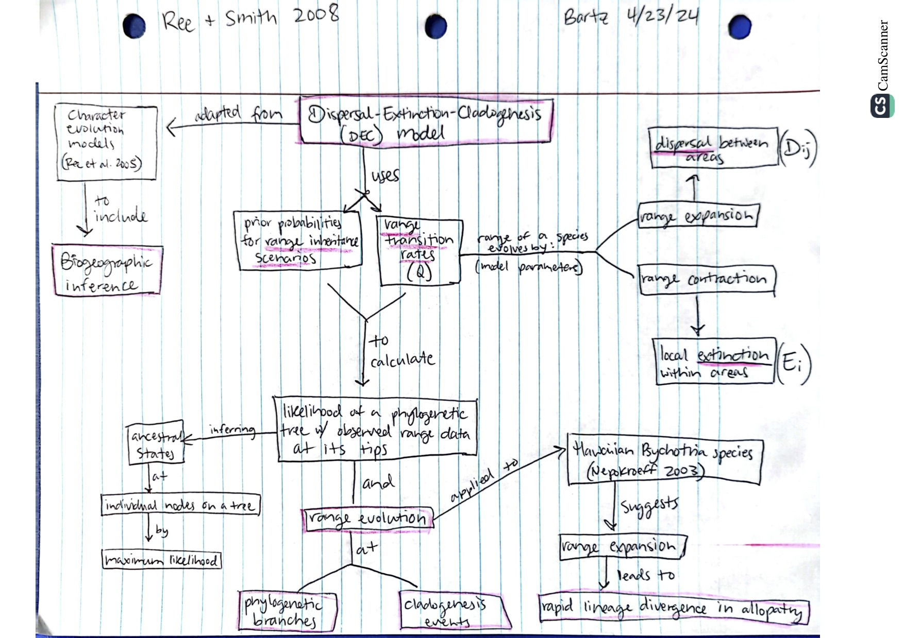

# April 23

## Phylogenetic approaches to biogeography

The spatial history of a group has long been an interest of evolutionary biologists, especially when we are interested in speciation, diversification, and patterns of biodiversity. In fact, biological evidence was a strong justification for the theory of plate tectonics. Today geology and evolutionary biology are mutually reinforcing sources of information to understand how things came to be. From purely descriptive arguments for biogeograhical sequences, the first methods were cladistic, later explicit mathematical models were applied to spatial occurrence data within the context of phylogeny.

### 55. [Ree, R. H., and Smith, S. A. 2008](https://drive.google.com/drive/u/0/folders/1ocqMPD5gX9xi4VQy_5OtU5wSyg-X8ftM). Maximum likelihood inference of geographical range evolution by dispersal, local extinction, and cladogenesis. Systematic Biology, 57(1):4-14. 

Ree and Smith 2008 made a big spash with a maximum likelihood method (Dispersal-Extinction-Cladogenesis or DEC models) to describe the evolution of geographic ranges across a phylogeny. Bayesian implementation of this and related methods quickly followed. 

55.Notes - [DEC model cartoons](./ReeSmith2008notes.pdf) - see also in drive

#### Concept Map by Dani Bartz  

#### Questions

1. On the last page, the authors mentioned that the DEC model may in fact be a poor fit to data on island biogeography, as exemplified by the case of Hawaiian Psychotria. How might this type of model differ in a location that is not separated by ocean barriers (such as a large continuous jungle or desert)?

2. In Hawai'i they assumed that ancestral colonization occurred soon after island origination, starting with Kauai. How might this colonization change in a region that is all the same age? Or what about with a highly migratory species such as seabirds?

### 56. [Landis, M. J., Quintero, I., Munoz, M.M., Zapata, F., and Donoghue, M.J. 2022](https://drive.google.com/drive/u/0/folders/1ocqMPD5gX9xi4VQy_5OtU5wSyg-X8ftM). Phylogenetic inference of where species spread or split across barriers. *PNAS* 119:e2116948119 https://doi.org/10.1073/pnas.2116948119 

Landis and colleagues demonstrate the use of the geographic range evoution models along with GeoSSE models to study hypotheses of geographic barriers that lead to evolution by vicariance. They also include additional hypotheses that can influence diversifcation and show how to compare the hypotheses in a modern statistical model-comparison framework.  

#### Concept Map by Danny Cusimano  

#### Questions

### 57. [Losos, J.B., Ricklefs, R.E. 2009](https://drive.google.com/drive/u/0/folders/1ocqMPD5gX9xi4VQy_5OtU5wSyg-X8ftM) Adaptation and diversification on islands. Nature 457:830-836 doi:10.1038/nature07893  **map:Rai**  

Losos and Ricklefs wrote this very interesting paper on Darwinʻs bicenntenial. They explored the roles of contingency and determinism in the diversification of species, and the special roles that islands may play (adding in ideas of island biogeography).

#### Concept Map by Rai Malayaj  

#### Questions

1. What is speciation threshold and how does it influence the rate of speciation?

2. What's more in line with evolutionary outcomes on islands? Contingency or deterministic patterns?