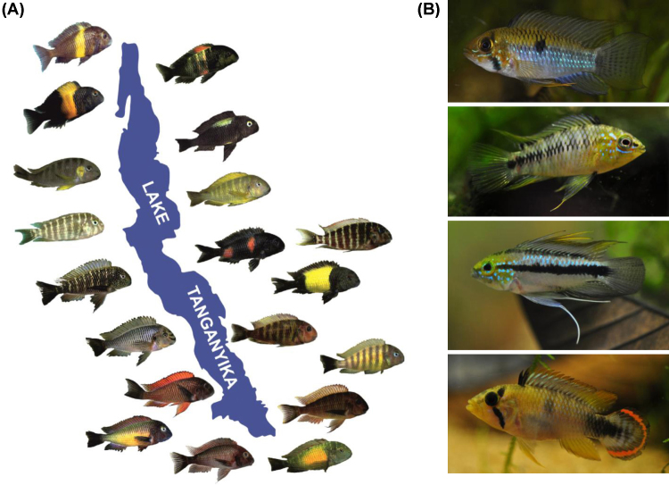

# April 25

## Hybridization

Is hybridization a destructive or a cohesive or force in evolution? On the one hand, hybridizing species may not be able to maintain distinct gene pools, merging into a single reticulate species (after all, the very idea that genetic "segregation" is what is responsible for the creation of new species is the definition of the Biological Species Concept). On the other hand, there are examples of hybrid zones that are stable and persistent. Why are they stable? Are they sources of genetic variation as genes cross species? Recently researchers have proposed ancient hybrid origins of adaptive radiation. The plot thickens.

### 58. [Wendel, J. F. 2000.](https://drive.google.com/drive/u/0/folders/1ocqMPD5gX9xi4VQy_5OtU5wSyg-X8ftM). Genome evolution in polyploids. Plant Molecular Biology 42: 225-249. **map:Allison**  

#### Concept Map by Allison Fisher  

#### Questions

1. On page 231, Wendel raises the idea of “evolutionary flicker” where genes turn off and on. Do you think gene resuscitation via back mutation is really probable? Or can you think of an alternative explanation for what might be observed as “flickering”?

2. We know different types of genes evolve at different rates. Do you think a duplication event might change these relative rates? 

### African Cichlids 

The East African rift-lake cichlid radiaions (over 1500 species) are one of the most speciose and well-studied adaptive radiations of vertebrates. They have extensively diversified in feeding niche and jaw morphology, suggesting divergence resulting from natural selection (This is from Karel Leimʻs work in the 70s): 

 A lot of work has gone into understanding their morphological and functional variation. For example these images show lateral line evoluiton in relation to feeding morphs (from DOI:https://doi.org/10.1016/j.isci.2019.05.016)

  

    
  

  

    
  

 

They also have extensive variation in coloration related to sexual selection (Both figures below from https://europepmc.org/article/PMC/3778878): 

Fig. 1. Colour variation in African and neotropical cichlids. (A) Tropheus spp. colour morphs in Lake Tanganyika (photos by Wolfgang Gessl: www.pisces.at and Peter Berger: www.afrika-cichliden.de; see also Egger et al. [93]). (B) Apistogramma spp from the Amazon basin (top to bottom: A. steindachneri, A. borelli, A. trifasciata, A. panduro. Photos by Ricardo Britzke).

Fig 2. Examples of the Haplochromine blotch polymorphism (all females). (A) Lake Victoria, from top: Neochromis omnicaeruleus: ancestral brown phenotype (P morph), orange blotched (OB morph), white blotched (WB morph); Paralabidochromis chromogynos (WB morph); P. chilotes (WB morph). Paralabidochromis photos by Ole Seehausen. (B) Lake Malawi, from top: Labeotropheus trewavasae (P morph); L. trewavasae (OB morph); Metriaclima xanstomachus (OB morph); M. pyrsonotus (OB morph, commonly called ‘orange’ morph); M. callainos (OB morph, commonly called ‘white’ morph). All of the morphs presented are heterozygous for the OB allele of pax7, regardless of degree of blotching. (Malawi photos by Reade Roberts).

### 59. [Brawand, D., Wagner, C. E., Yang, I. L., et al. 2014](https://drive.google.com/drive/u/0/folders/1ocqMPD5gX9xi4VQy_5OtU5wSyg-X8ftM) The genomic substrate for adaptive radiation in African cichlid fish. Nature 513:375-381. doi:10.1038/nature13726  **map:Dani**  

#### Concept Map by Dani Bartz  

#### Questions

1. While it was ultimately concluded that all of the various mechanisms discussed played a role in the rapid diversification of African cichlids, which of the mechanisms do you think may have been the strongest and why?

2. Do you think that this level and speed of diversification was possible due to the closed system of a lake, or would you expect to see this in an ocean? What characteristics of a lake might increase or decrease fish diversification?

