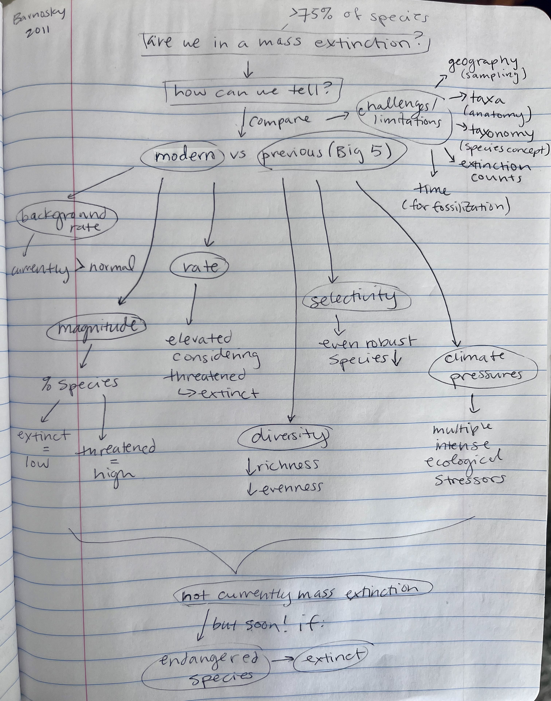

# April 30

## Extinction

Extinction is of course another important evolutionary process shaping biodiversity. Is extinction predictable? Are there any features of species or the environment or evolutionary process that predict extinction? Are rates of extinction increasing?

### 60. [Hampe, A., Petit, R. J. 2005](https://digital.csic.es/bitstream/10261/64087/1/j.1461-0248.2005.00739.x.pdf) Conserving biodiversity under climate change: the rear edge matter. Ecology Letters 8(5):461-467. **map:Danny**  

#### Concept Map by Daniel Cusimano

#### Questions

1. 

### 61. [Barnosky, A. D., Marzke, N., Tomiya, S., et al. 2011](https://drive.google.com/drive/u/0/folders/1ocqMPD5gX9xi4VQy_5OtU5wSyg-X8ftM) Has the Earth's sixth mass extinction already arrived? Nature: 471:51-57. DOI: 10.1038/nature09678  **map:Allison**  

#### Concept Map by Allison Fisher

#### Questions

1. 